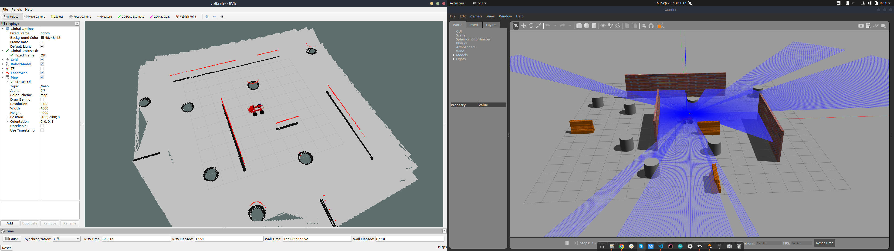
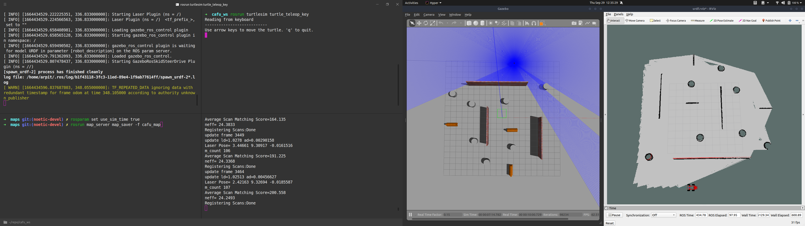
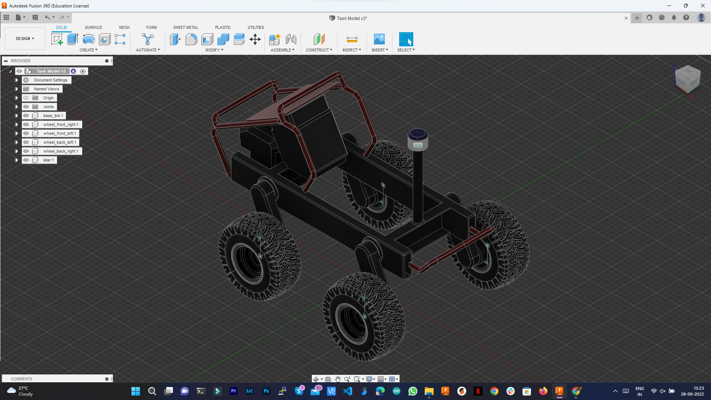
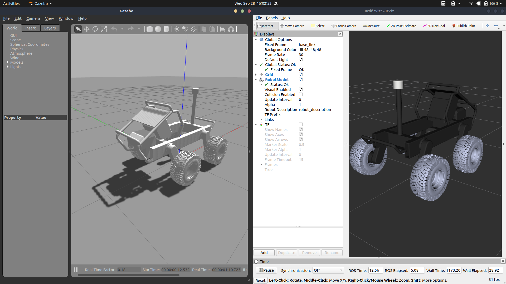

<!-- @format -->

# CAFU Technical Task

## Scenario

The simulation must have **4 Columns** in an open space and **3 separate** walls. The area must be
**10x10 meters**. Using the sensors, the Robot must follow the **GPS points (5 points will be enough)** to
reach the last one (Need to have the ability to change the points during the simulation).
Robot must avoid obstacles, if any, along the way.
Robot must create a SLAM map while running.
Please Explain all your decision about the used sensors and how the robot makes decisions to
avoid the obstacles 

## Finished map

## Mapping

## Robot CAD

## Robot URDF in Gazebo and Rviz

## Checklist

- ~~Need to create the simulation in the Gazebo according to the provided scenario.~~
- ~~In the Gazebo simulation need to use the 3D model of the robot which will be provided.~~
- ~~Need to Create a ROS node to control the provided 3Dmodel using a hardware joystick.~~
- ~~Use the same node and setup to create a SLAM map.~~
- ~~Need to Create a ROS node to automatically avoid the obstacles on the way.~~
- Need to Create a ROS node for GPS waypoint Navigation.

## To run

- Simulation: `roslaunch robot_description gazebo.launch`
- AMCL, map server, and move base: `roslaunch robot_description amcl.launch`
- Keyboard control: `rosrun teleop_twist_keyboard teleop_twist_keyboard.py`
- Follow waypoints: `roslaunch follow_waypoints follow_waypoints.launch`
- Waypoint navigation: `rostopic pub /path_ready std_msgs/Empty -1`
